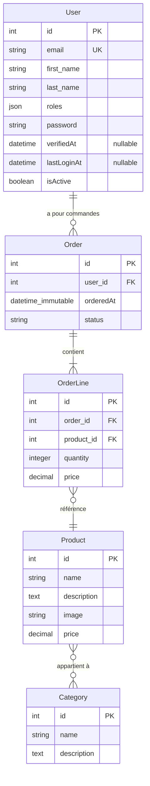

# Schéma Entité-Relation

## Diagramme ER

## Tables

### User
| Champ | Type | Contraintes |
|-------|------|-------------|
| id | integer | PK, auto-increment |
| email | string(180) | NOT NULL, UNIQUE |
| first_name | string(100) | NOT NULL |
| last_name | string(100) | NOT NULL |
| roles | json | NOT NULL, DEFAULT '[]' |
| password | string | NOT NULL |
| verified_at | datetime | NULLABLE |
| last_login_at | datetime | NULLABLE |
| is_active | boolean | NOT NULL, DEFAULT true |

### Category
| Champ | Type | Contraintes |
|-------|------|-------------|
| id | integer | PK, auto-increment |
| name | string(255) | NOT NULL |
| description | text | NOT NULL |

### Product
| Champ | Type | Contraintes |
|-------|------|-------------|
| id | integer | PK, auto-increment |
| name | string(255) | NOT NULL |
| description | text | NOT NULL |
| image | string(255) | NOT NULL |
| price | decimal(10,2) | NOT NULL |

### Order
| Champ | Type | Contraintes |
|-------|------|-------------|
| id | integer | PK, auto-increment |
| user_id | integer | FK → User.id, NOT NULL |
| ordered_at | datetime_immutable | NOT NULL |
| status | string(20) | NOT NULL (enum: confirmed, preparing, shipped, delivered, cancelled) |

### OrderLine
| Champ | Type | Contraintes |
|-------|------|-------------|
| id | integer | PK, auto-increment |
| order_id | integer | FK → Order.id, NOT NULL |
| product_id | integer | FK → Product.id, NOT NULL |
| quantity | integer | NOT NULL |
| price | decimal(10,2) | NOT NULL |

## Relations
- **User 1---* Order** : Un utilisateur peut avoir plusieurs commandes
- **Order 1---* OrderLine** : Une commande contient plusieurs lignes
- **OrderLine *---1 Product** : Une ligne référence un seul produit
- **Product *---* Category** : Un produit peut avoir plusieurs catégories (table `product_category`)
