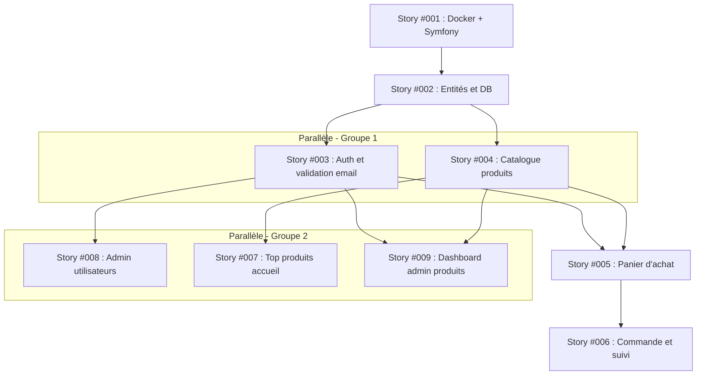

# Plan d'implémentation des stories

## Ordre d'implémentation recommandé

1. **Story #001** - Environnement Docker et socle Symfony (Priorité : Haute)
   - Justification : Fondation technique, aucune dépendance. Tout le reste en dépend.

2. **Story #002** - Entités et schéma de base de données (Priorité : Haute)
   - Justification : Dépend de #001. Nécessaire pour toutes les fonctionnalités métier.

3. **Story #003** - Inscription, connexion et validation email (Priorité : Haute)
   - Justification : Dépend de #002. Indispensable pour panier, commandes, admin.

4. **Story #004** - Catalogue produits et navigation (Priorité : Haute)
   - Justification : Dépend de #002. Peut être développée en parallèle de #003.

5. **Story #007** - Top produits et page d'accueil (Priorité : Moyenne)
   - Justification : Dépend de #004. Visibilité immédiate sur la page d'accueil.

6. **Story #009** - Dashboard admin et gestion des produits/catégories (Priorité : Haute)
   - Justification : Dépend de #003 et #004. Permet à l'admin de gérer le catalogue.

7. **Story #008** - Administration des utilisateurs (Priorité : Haute)
   - Justification : Dépend de #003 et #002. Gestion des comptes et commandes console.

8. **Story #005** - Panier d'achat (Priorité : Haute)
   - Justification : Dépend de #003 et #004. Nécessaire avant les commandes.

9. **Story #006** - Passage de commande et suivi (Priorité : Haute)
   - Justification : Dépend de #005. Dernière étape du parcours client.

## Stories développables en parallèle

- **Groupe 1** : Story #003, Story #004 (dépendent de #002, aucune dépendance croisée)
- **Groupe 2** : Story #007, Story #008, Story #009 (dépendent de #003/#004, indépendantes entre elles)

## Diagramme de dépendances

## Notes
- Les stories doivent être implémentées dans l'ordre indiqué pour respecter les dépendances
- Les groupes en parallèle peuvent être développés simultanément
- Les tests unitaires et d'intégration (PHPUnit) accompagnent chaque story
- Les tests E2E (Playwright) avec scénarios lisibles sont prévus pour chaque story concernée
- Toute la documentation doit être centralisée dans le README.md
