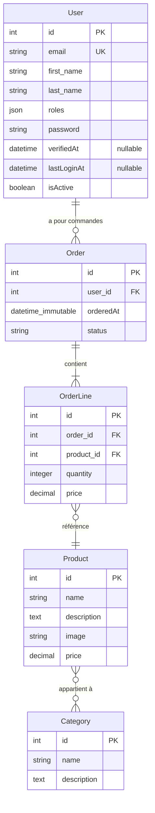

# Tâche #003 - Story #002 : Migration, tests et documentation

## Objectif
Générer la migration Doctrine pour les 5 entités, l'appliquer, puis implémenter les tests automatisés (unitaires + intégration) et la documentation du schéma entité-relation.

## Contexte
- Story #002 : `docs/stories/story-002.md`
- Dépend de : Tâche #001, Tâche #002 (toutes les entités doivent exister)
- Nécessaire pour : Stories #003, #004 et suivantes

## Prompt

En tant qu'agent de code, tu dois implémenter ce qui suit.

### Description fonctionnelle

**Partie 1 : Migration Doctrine**
- Générer une migration Doctrine à partir des 5 entités
- Vérifier que le SQL généré correspond bien au schéma attendu (tables, colonnes, clés étrangères, table de jointure)
- La table de jointure `product_category` doit être créée avec les bonnes clés étrangères
- Toutes les contraintes NOT NULL, clés primaires, clés étrangères et index doivent être présents

**Partie 2 : Tests automatisés**
- Tests unitaires : valider les getters/setters de chaque entité (5 entités)
- Tests d'intégration : création et persistance en base de test pour chaque entité avec ses relations

**Partie 3 : Documentation**
- Créer un diagramme entité-relation au format Mermaid
- Documenter le schéma dans un fichier dédié

**Cas nominaux :**
- `php bin/console doctrine:migrations:diff` génère une migration valide
- `php bin/console doctrine:migrations:migrate --no-interaction` applique la migration sans erreur
- Tous les tests unitaires passent
- Tous les tests d'intégration passent (persistence en base de test)
- Le schéma ER est documenté avec Mermaid

**Cas limites :**
- Si des migrations existent déjà (de story-001), la nouvelle migration doit s'empiler correctement
- Les tests d'intégration doivent utiliser la base de test (suffixe `_test`)
- Les tests doivent être indépendants et ne pas dépendre de l'ordre d'exécution

**Gestion d'erreurs :**
- Migration échouée → message d'erreur clair affiché par Doctrine
- Test de persistance échoué → assertion PHPUnit avec message descriptif

### Fichiers concernés

| Fichier | Action | Description |
|---------|--------|-------------|
| `migrations/Version*.php` | Créer | Migration Doctrine générée automatiquement |
| `tests/Entity/UserEntityTest.php` | Créer | Tests unitaires User (getters/setters) |
| `tests/Entity/CategoryEntityTest.php` | Créer | Tests unitaires Category |
| `tests/Entity/ProductEntityTest.php` | Créer | Tests unitaires Product (avec relations) |
| `tests/Entity/OrderEntityTest.php` | Créer | Tests unitaires Order (avec relations) |
| `tests/Entity/OrderLineEntityTest.php` | Créer | Tests unitaires OrderLine |
| `tests/Entity/EntityPersistenceTest.php` | Créer | Tests d'intégration : persistance de chaque entité |
| `docs/schema-er.md` | Créer | Documentation du schéma entité-relation avec diagramme Mermaid |
| `README.md` | Modifier | Ajouter un lien vers `docs/schema-er.md` |

### Signatures des tests

#### Tests unitaires (exemple pour User)

```php
// tests/Entity/UserEntityTest.php
namespace App\Tests\Entity;

use App\Entity\User;
use PHPUnit\Framework\Attributes\Test;
use PHPUnit\Framework\TestCase;

class UserEntityTest extends TestCase
{
    #[Test]
    public function userGettersAndSetters(): void
    {
        $user = new User();
        $user->setEmail('test@example.com');
        $user->setFirstName('John');
        $user->setLastName('Doe');
        $user->setRoles(['ROLE_USER']);
        $user->setPassword('hashed_password');
        $user->setVerifiedAt(new \DateTimeImmutable('2026-01-01'));
        $user->setLastLoginAt(new \DateTimeImmutable('2026-01-02'));
        $user->setIsActive(true);

        $this->assertNull($user->getId());
        $this->assertEquals('test@example.com', $user->getEmail());
        $this->assertEquals('John', $user->getFirstName());
        $this->assertEquals('Doe', $user->getLastName());
        $this->assertEquals(['ROLE_USER'], $user->getRoles());
        $this->assertEquals('hashed_password', $user->getPassword());
        $this->assertInstanceOf(\DateTimeInterface::class, $user->getVerifiedAt());
        $this->assertInstanceOf(\DateTimeInterface::class, $user->getLastLoginAt());
        $this->assertTrue($user->isActive());
    }

    #[Test]
    public function userDefaultValues(): void
    {
        $user = new User();
        $this->assertEquals([], $user->getRoles());
        $this->assertTrue($user->isActive());
        $this->assertNull($user->getVerifiedAt());
        $this->assertNull($user->getLastLoginAt());
    }

    #[Test]
    public function userNullableDates(): void
    {
        $user = new User();
        $user->setVerifiedAt(null);
        $user->setLastLoginAt(null);
        $this->assertNull($user->getVerifiedAt());
        $this->assertNull($user->getLastLoginAt());
    }
}
```

#### Tests d'intégration (persistance avec rollback)

```php
// tests/Entity/EntityPersistenceTest.php
namespace App\Tests\Entity;

use App\Entity\Category;
use App\Entity\Order;
use App\Entity\OrderLine;
use App\Entity\Product;
use App\Entity\User;
use App\Enum\OrderStatus;
use Doctrine\ORM\EntityManagerInterface;
use PHPUnit\Framework\Attributes\Test;
use Symfony\Bundle\FrameworkBundle\Test\KernelTestCase;

class EntityPersistenceTest extends KernelTestCase
{
    private EntityManagerInterface $entityManager;

    protected function setUp(): void
    {
        $kernel = self::bootKernel();
        $this->entityManager = $kernel->getContainer()
            ->get('doctrine')
            ->getManager();
        $this->entityManager->beginTransaction();
    }

    #[Test]
    public function canPersistUser(): void
    {
        $user = new User();
        $user->setEmail('test@example.com');
        $user->setFirstName('John');
        $user->setLastName('Doe');
        $user->setPassword('hashed');

        $this->entityManager->persist($user);
        $this->entityManager->flush();

        $this->assertNotNull($user->getId());
        $this->assertGreaterThan(0, $user->getId());
    }

    #[Test]
    public function canPersistCategory(): void
    {
        $category = new Category();
        $category->setName('Fruits');
        $category->setDescription('Fruits frais de saison');

        $this->entityManager->persist($category);
        $this->entityManager->flush();

        $this->assertNotNull($category->getId());
    }

    #[Test]
    public function canPersistProductWithCategory(): void
    {
        $category = new Category();
        $category->setName('Fruits');
        $category->setDescription('Fruits frais');
        $this->entityManager->persist($category);

        $product = new Product();
        $product->setName('Pomme Golden');
        $product->setDescription('Pomme golden delicious');
        $product->setImage('pomme-golden.jpg');
        $product->setPrice('2.50');
        $product->addCategory($category);

        $this->entityManager->persist($product);
        $this->entityManager->flush();

        $this->assertNotNull($product->getId());
        $this->assertCount(1, $product->getCategories());
    }

    #[Test]
    public function canPersistFullOrder(): void
    {
        $user = new User();
        $user->setEmail('client@example.com');
        $user->setFirstName('Jane');
        $user->setLastName('Doe');
        $user->setPassword('hashed');
        $this->entityManager->persist($user);

        $product = new Product();
        $product->setName('Pomme');
        $product->setDescription('Pomme bio');
        $product->setImage('pomme.jpg');
        $product->setPrice('1.50');
        $this->entityManager->persist($product);

        $order = new Order();
        $order->setUser($user);
        $this->entityManager->persist($order);

        $orderLine = new OrderLine();
        $orderLine->setOrder($order);
        $orderLine->setProduct($product);
        $orderLine->setQuantity(3);
        $orderLine->setPrice('1.50');
        $this->entityManager->persist($orderLine);

        $this->entityManager->flush();

        $this->assertNotNull($order->getId());
        $this->assertNotNull($orderLine->getId());
        $this->assertSame($user, $order->getUser());
        $this->assertCount(1, $order->getOrderLines());
    }

    protected function tearDown(): void
    {
        $this->entityManager->rollback();
        $this->entityManager->close();
        parent::tearDown();
    }
}
```

### Contraintes techniques
- **PHPUnit 13** : Utiliser l'attribut `#[Test]` (pas `@test`), étendre `TestCase` pour les tests unitaires et `KernelTestCase` pour les tests d'intégration
- **Base de test** : La config Doctrine utilise déjà `dbname_suffix: '_test%env(default::TEST_TOKEN)%'` dans `doctrine.yaml` (section `when@test`). Aucune configuration manuelle nécessaire.
- **Nettoyage via rollback** : Ouvrir une transaction dans `setUp()` et faire `rollback()` dans `tearDown()` — chaque test est isolé, aucune donnée persistée entre les tests
- **Déclarations strictes** : `declare(strict_types=1)` dans tous les fichiers
- **Migration** : Utiliser `php bin/console make:migration` (MakerBundle) ou `php bin/console doctrine:migrations:diff` pour générer la migration. Vérifier le SQL généré avant de l'appliquer.
- **Mermaid** : Le diagramme ER doit être en Mermaid (format `erDiagram`) et placé dans `docs/schema-er.md`

### Documentation

#### Documentation à créer

**`docs/schema-er.md`** : Documentation du schéma entité-relation

```markdown
# Schéma Entité-Relation

## Diagramme ER



## Tables

### User
| Champ | Type | Contraintes |
|-------|------|-------------|
| id | integer | PK, auto-increment |
| email | string(180) | NOT NULL, UNIQUE |
| first_name | string(100) | NOT NULL |
| last_name | string(100) | NOT NULL |
| roles | json | NOT NULL, DEFAULT '[]' |
| password | string | NOT NULL |
| verified_at | datetime | NULLABLE |
| last_login_at | datetime | NULLABLE |
| is_active | boolean | NOT NULL, DEFAULT true |

### Category
| Champ | Type | Contraintes |
|-------|------|-------------|
| id | integer | PK, auto-increment |
| name | string(255) | NOT NULL |
| description | text | NOT NULL |

### Product
| Champ | Type | Contraintes |
|-------|------|-------------|
| id | integer | PK, auto-increment |
| name | string(255) | NOT NULL |
| description | text | NOT NULL |
| image | string(255) | NOT NULL |
| price | decimal(10,2) | NOT NULL |

### Order
| Champ | Type | Contraintes |
|-------|------|-------------|
| id | integer | PK, auto-increment |
| user_id | integer | FK → User.id, NOT NULL |
| ordered_at | datetime_immutable | NOT NULL |
| status | string(20) | NOT NULL (enum: confirmed, preparing, shipped, delivered, cancelled) |

### OrderLine
| Champ | Type | Contraintes |
|-------|------|-------------|
| id | integer | PK, auto-increment |
| order_id | integer | FK → Order.id, NOT NULL |
| product_id | integer | FK → Product.id, NOT NULL |
| quantity | integer | NOT NULL |
| price | decimal(10,2) | NOT NULL |

## Relations
- **User 1---* Order** : Un utilisateur peut avoir plusieurs commandes
- **Order 1---* OrderLine** : Une commande contient plusieurs lignes
- **OrderLine *---1 Product** : Une ligne référence un seul produit
- **Product *---* Category** : Un produit peut avoir plusieurs catégories (table `product_category`)
```

### Tests à implémenter

**Fichiers de tests unitaires** (5 fichiers) :
| Fichier | Scénarios |
|---------|-----------|
| `tests/Entity/UserEntityTest.php` | Getters/setters, valeurs par défaut, dates nullables |
| `tests/Entity/CategoryEntityTest.php` | Getters/setters |
| `tests/Entity/ProductEntityTest.php` | Getters/setters, ajout/retrait de catégorie |
| `tests/Entity/OrderEntityTest.php` | Getters/setters, statut par défaut, ajout/retrait d'OrderLine |
| `tests/Entity/OrderLineEntityTest.php` | Getters/setters, relation avec Order et Product |

**Fichier de tests d'intégration** :
| Fichier | Scénarios |
|---------|-----------|
| `tests/Entity/EntityPersistenceTest.php` | Persistance User, Category, Product+Category, Order complet avec OrderLine |

### Documentation à mettre à jour
- `README.md` : Ajouter une section "Schéma de données" avec un lien vers `docs/schema-er.md`
